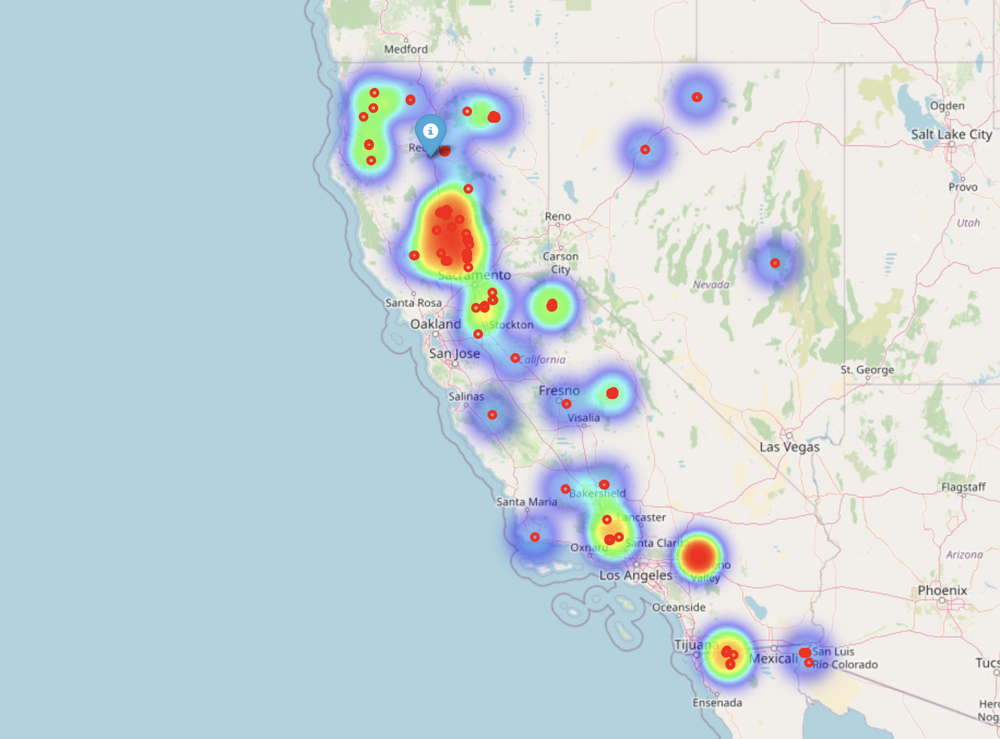

<p align="center">
    
</p>


# California Wildfire Visualization
## Overview
This project visualizes the most recent wildfire data from NASA's Fire Information for Resource Management System (FIRMS) for the state of California. Using the MODIS satellite data, the script generates an interactive map that displays active wildfires, highlighting their intensity and locations, including a special marker for Redding, CA.

<p align="center">
    
</p>


## Features
**Real-Time Satellite Data**: Fetches the latest wildfire data from the NASA FIRMS API, ensuring up-to-date information on active fires.
**Heatmap Visualization**: Represents the intensity and frequency of wildfires across different regions of California using a heatmap.
**Detailed Markers**: Each active fire is marked on the map with details about its brightness (intensity) and the date it was detected.
**Focus on Redding, CA**: Includes a distinct marker for Redding, CA, providing quick visibility to fires near this area.

## Data Source
The data is sourced from NASA's FIRMS via the MODIS satellite. This satellite monitors the earth in real time, providing critical data for natural disaster monitoring and environmental research.

## Installation Requirements
Python 3.x

```commandline
pip install pandas folium requests
```

```commandline
export NASA_API_KEY='generate here: https://firms.modaps.eosdis.nasa.gov/api/area/html'
```

## Project Structure
These files will be created when the script is run;
- **fires.csv**: CSV file containing the latest fire data.
- **california_wildfires_heatmap.html**: Interactive HTML map file. 

Scripts and additional documentation will be added as the project evolves.

## Contributing
We welcome contributions to improve the accuracy and features of this visualization tool. Please submit your pull requests or issue tickets via GitHub.

## License
This project is licensed under the MIT License - see the LICENSE file for details.

## Acknowledgements
NASA FIRMS: For providing open access to fire data.
The MODIS satellite team for their continuous efforts in earth monitoring.